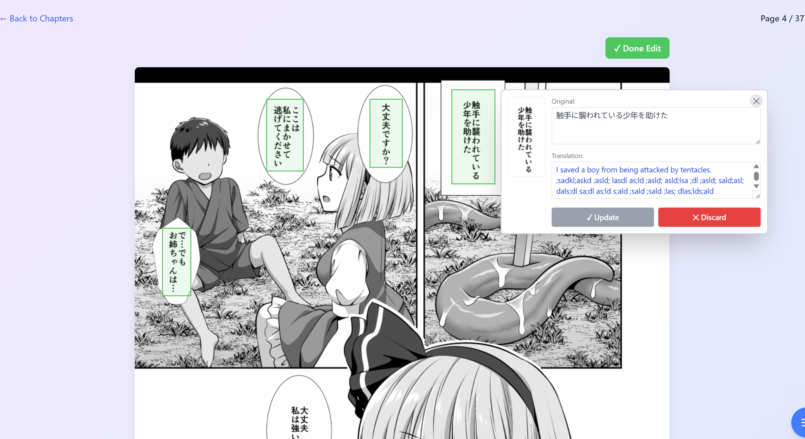
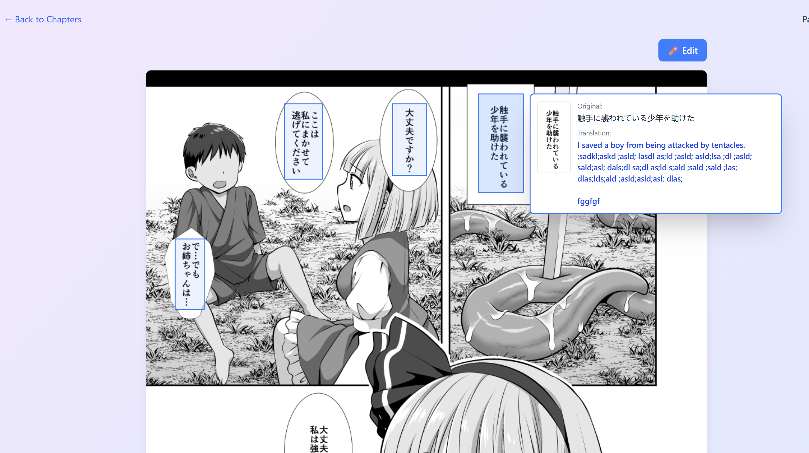
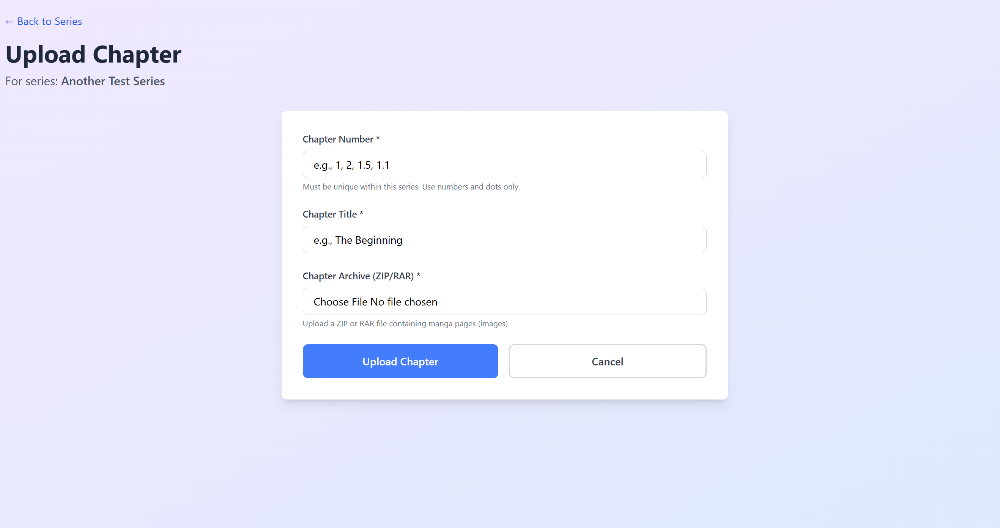
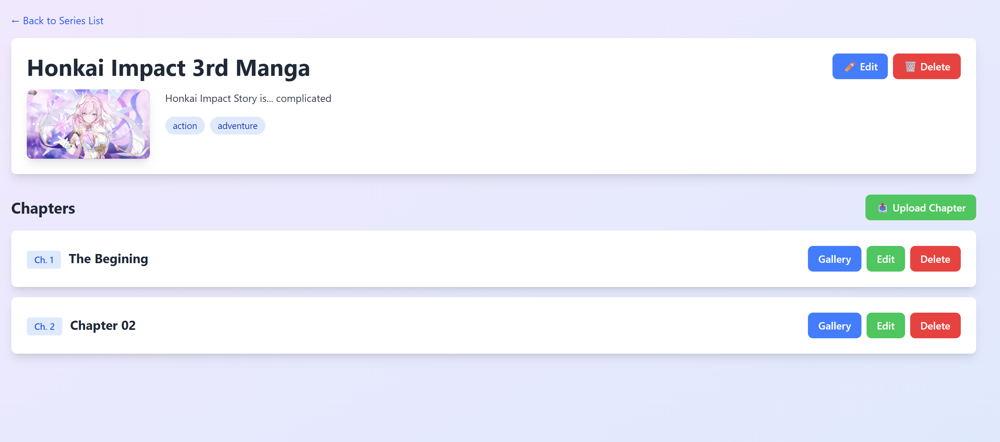
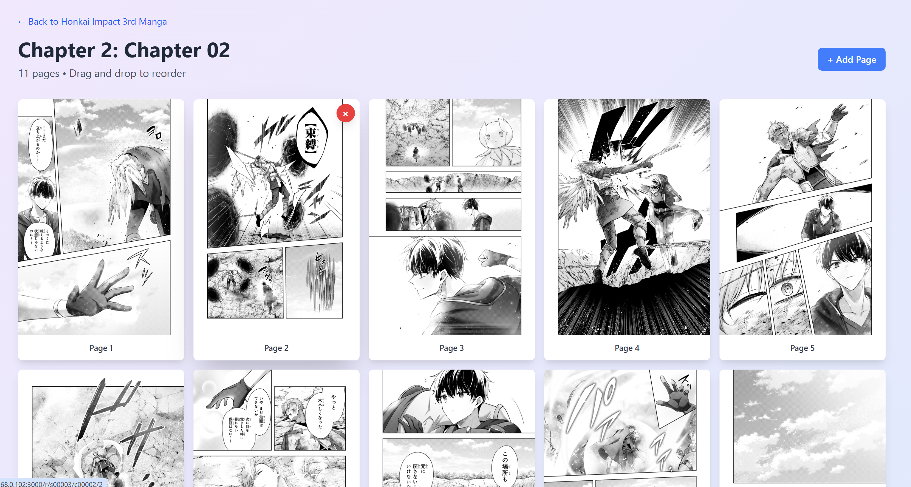

# Comic Reader

A manga/comic reader with OCR text extraction and translation capabilities.

[](https://github.com/deckyfx/manga-reader/blob/main/LICENSE)
[](https://github.com/deckyfx/manga-reader)


## Features

- 📚 **Series & Chapter Management** - Organize manga by series with chapter uploads
- 🖼️ **Image Reader** - Clean, responsive manga reading interface
- 🎯 **Region Selection** - Drag-and-resize to select text regions
- 🔍 **Real-time OCR** - Extract Japanese text from manga panels using manga-ocr
- 🌐 **Automatic Translation** - Translate extracted text using DeepL API
- 💾 **Caption Database** - Save and manage OCR/translation results with SQLite
- 🏷️ **Tagging System** - Filter and search series by tags
- 🚀 **Fast Performance** - Bun runtime with Unix socket IPC for OCR service

## Showcase

<div align="center">
  <table>
    <tr>
      <td width="33%"></td>
      <td width="33%"></td>
      <td width="33%"></td>
    </tr>
    <tr>
      <td width="33%"></td>
      <td width="33%"></td>
      <td width="33%"></td>
    </tr>
  </table>
</div>

## Architecture

```
┌─────────────────┐
│  Bun/ElysiaJS   │  Main application server
│   + React UI    │  (TypeScript)
└────────┬────────┘
         │ Unix Socket
         │ IPC
┌────────▼────────┐
│  FastAPI Server │  OCR service
│  + manga-ocr    │  (Python)
└─────────────────┘
```

**Key Components:**

- **Main App (Bun)**: ElysiaJS server with React frontend
- **OCR Service (Python)**: FastAPI server with manga-ocr model
- **IPC**: Unix domain socket for fast communication
- **Database**: SQLite with Drizzle ORM
- **Translation**: DeepL API integration

## Technology Stack

### Backend
- **[Bun](https://bun.sh/)** - Fast JavaScript runtime
- **[ElysiaJS](https://elysiajs.com/)** - Type-safe web framework
- **[Drizzle ORM](https://orm.drizzle.team/)** - TypeScript ORM for SQLite
- **[FastAPI](https://fastapi.tiangolo.com/)** - Python web framework for OCR service

### Frontend
- **[React](https://react.dev/)** - UI framework
- **[Tailwind CSS](https://tailwindcss.com/)** - Utility-first CSS

### OCR & Translation
- **[manga-ocr](https://github.com/kha-white/manga-ocr)** - Japanese manga OCR model
- **[DeepL API](https://www.deepl.com/docs-api)** - Neural machine translation

## Prerequisites

- [Docker](https://www.docker.com/) & Docker Compose
- [DeepL API Key](https://www.deepl.com/pro-api) (for translation)
- **Disk Space**: ~3.5 GB (includes model download on first run)
- **RAM**: ~400 MB (idle)

### System Requirements

| Component | Disk Space | RAM (idle) |
|-----------|------------|------------|
| Main App | 1.78 GB | ~106 MB |
| OCR Service | 1.32 GB | ~275 MB |
| manga-ocr Model* | ~400 MB | - |
| **Total** | **~3.5 GB** | **~381 MB** |

*Downloaded automatically on first startup and cached in `data/models/`

## Installation

### 1. Clone Repository

```bash
git clone https://github.com/deckyfx/manga-reader.git
cd manga-reader
```

### 2. Environment Configuration

Create `.env` file in the project root:

```bash
# Application
APP_NAME=comic-reader
NODE_ENV=development
SERVER_PORT=3000

# Data Directory (local development)
DATA_DIR=./data

# DeepL Translation API
DEEPL_API_KEY=your_deepl_api_key_here
```

### 3. Start Services

```bash
# Build and start all services
docker-compose up -d

# View logs
docker-compose logs -f
```

### 4. Accessing

You can now access the app at `http://localhost:3000`

## Credits

### Open Source Projects

- **[manga-ocr](https://github.com/kha-white/manga-ocr)** by [@kha-white](https://github.com/kha-white) - Optical character recognition (OCR) for Japanese manga. This project would not be possible without this amazing OCR model specifically trained for manga text extraction.

- **[Bun](https://bun.sh/)** - Fast all-in-one JavaScript runtime
- **[ElysiaJS](https://elysiajs.com/)** - Web framework for Human
- **[Drizzle ORM](https://orm.drizzle.team/)** - TypeScript ORM
- **[FastAPI](https://fastapi.tiangolo.com/)** - Modern Python web framework
- **[React](https://react.dev/)** - JavaScript library for user interfaces
- **[Tailwind CSS](https://tailwindcss.com/)** - Utility-first CSS framework

## License

MIT License - See [LICENSE](LICENSE) file for details

## Contributing

Contributions are welcome! Please feel free to submit a Pull Request.

## Support

If you encounter any issues or have questions:
1. Check existing [Issues](https://github.com/deckyfx/manga-reader/issues)
2. Create a new issue with detailed information
3. Include logs and error messages when applicable

---

**Note**: This is a personal project for manga reading with OCR capabilities. Make sure you have the right to use any manga content you upload to this application.
